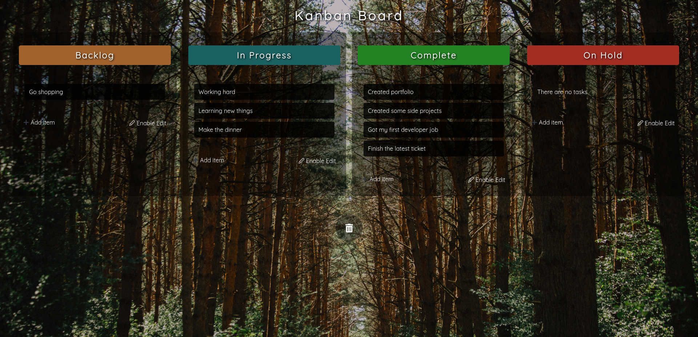

# Drag and Drop 📝

App using a kanban board with tasks that can be dragged and dropped between kaban cycles

# Screenshot

# Tools

- [React](https://es.reactjs.org/) - Library for UI
- [CSS Modules](https://create-react-app.dev/docs/adding-a-css-modules-stylesheet/) - CSS Modules
- [react-contenteditable](https://www.npmjs.com/package/react-contenteditable) - For adding and editing tasks
- [react-dnd](https://www.npmjs.com/package/react-dnd) - For Drag and Drop on tasks
- [react-use-storage](https://www.npmjs.com/package/react-use-storage) - Local Storage for saving tasks on the browser

# Deployment

[Vercel](https://drag-and-drop-taupe.vercel.app/)

# To run this app

1. Clone this repo
2. Run `npm install`
3. Run `npm start`
